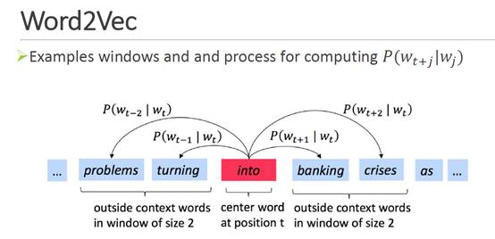

课程地址：

https://github.com/yandexdataschool/nlp_course/blob/master/week01_embeddings/seminar.ipynb

## 一、 LSA

latent semantic analysis（LSA），潜语义分析。将文章和单词懂映射到语义空间（ “concept” space ）上，并在该空间进行对比分析。在搜索中，文档的相似性并不应该由两个文本包含的词直接决定，而是应该去比较隐藏在词之后的意义和概念。比如用户搜索“automobile”，即汽车，传统向量空间模型仅仅会返回包含“automobile”单词的页面，而实际上包含”car”单词的页面也可能是用户所需要的。潜语义分析试图去解决这个问题，它把词和文档都映射到一个潜在语义空间，文档的相似性在这个空间内进行比较。潜语义空间的维度个数可以自己指定，往往比传统向量空间维度更少，所以LSA也是一种降维技术。https://www.cnblogs.com/datalab/p/3163692.html

 

## 二、 word embeddings：

### 1、W2V

We will learn a dense vector for each word, chosen so that it is similar to vectors of words that appear in similar contexts. This word vectors are called word embeddings or word representations

 

https://www.jianshu.com/p/471d9bfbd72f（最清晰）

https://blog.csdn.net/yu5064/article/details/79601683

https://www.cnblogs.com/guoyaohua/p/9240336.html

CBOW（Continuous Bag-of-Word Model）又称连续词袋模型，是一个三层神经网络。该模型的特点是输入已知上下文，输出对当前单词的预测。 

Skip-gram是已知当前词语，预测上下文。         

 

Word2Vec模型是一个超级大的神经网络（权重矩阵规模非常大），在如此庞大的神经网络中进行梯度下降是相当慢的，需要大量的训练数据来调整这些权重并且避免过拟合。

例如，有一个包含10000个单词的词汇表，向量特征为300维，我们记得这个神经网络将会有两个weights矩阵----一个隐藏层和一个输出层。这两层都会有一个300x10000=3000000的weight矩阵。

负采样（negative sampling）解决了这个问题，它是用来提高训练速度并且改善所得到词向量的质量的一种方法。不同于原本每个训练样本更新所有的权重，负采样每次让一个训练样本仅仅更新一小部分的权重，这样就会降低梯度下降过程中的计算量。

 

term-document矩阵中，行是 word，列是 document，A[i][j]代表word[i]在document[j]中的出现次数，可以提取行向量作为word的语义向量，或取列向量作为document的主题向量。这种co-occurrence矩阵仍然存在着数据稀疏性和维度灾难的问题，为此，人们提出了一系列对矩阵进行降维的方法（如LSI／LSA等）。这些方法大都是基于SVD的思想，将原始的稀疏矩阵分解为两个低秩矩阵乘积的形式。

 

One-hot vectors are orthogonal and do not contain information about a meaning of a word

distributional semantics 分布语义

Dristributed representation可以解决One hot representation的问题，它的思路是通过训练，将每个词都映射到一个较短的词向量上来。

stop word。 “在”、“里面”、“也”、“的”、“它”、“为”这些词都是停止词。这些词因为使用频率过高，将这一类词语全部忽略掉。

 

 

### 2、GloVe (较难理解)

https://blog.csdn.net/u014665013/article/details/79642083

https://blog.csdn.net/u014422406/article/details/77801243(better)

 

### 3、fastText:

在文本特征提取中，常常能看到n-gram的身影。它是一种基于语言模型的算法，基本思想是将文本内容按照字节顺序进行大小为N的滑动窗口操作，最终形成长度为N的字节片段序列。看下面的例子：

我来到达观数据参观

相应的bigram特征为：我来 来到 到达 达观 观数 数据 据参 参观

相应的trigram特征为：我来到 来到达 到达观 达观数 观数据 数据参 据参观

注意一点：n-gram中的gram根据粒度不同，有不同的含义。它可以是字粒度，也可以是词粒度的。上面所举的例子属于字粒度的n-gram，词粒度的n-gram看下面例子：

我 来到 达观数据 参观 相应的bigram特征为：我/来到 来到/达观数据 达观数据/参观相应的trigram特征为：我/来到/达观数据 来到/达观数据/参观 

http://www.52nlp.cn/fasttext

 

n-gram包含了词的顺序信息，为了处理词顺序丢失的问题，FastText增加了N-gram的特征。具体做法是把N-gram当成一个词，也用embedding向量来表示，在计算隐层时，把N-gram的embedding向量也加进去求和取平均。

通过back-propogation算法，就可以同时学到词的Embeding和n-gram的Embedding了。具体实现上，由于n-gram的量远比word大的多，完全存下所有的n-gram也不现实。FastText采用了Hash桶的方式，把所有的n-gram都哈希到buckets个桶中，哈希到同一个桶的所有n-gram共享一个embedding vector。

 

 

 

 

 

 